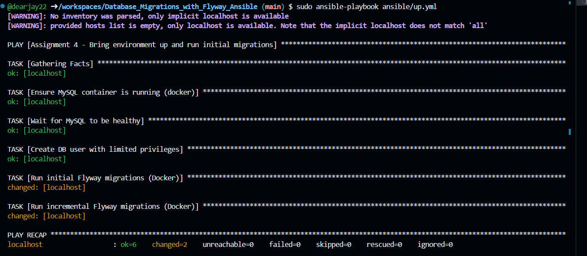
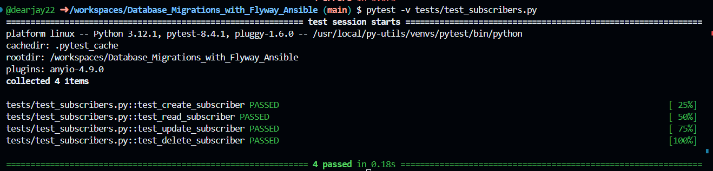
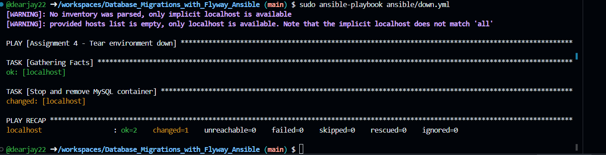
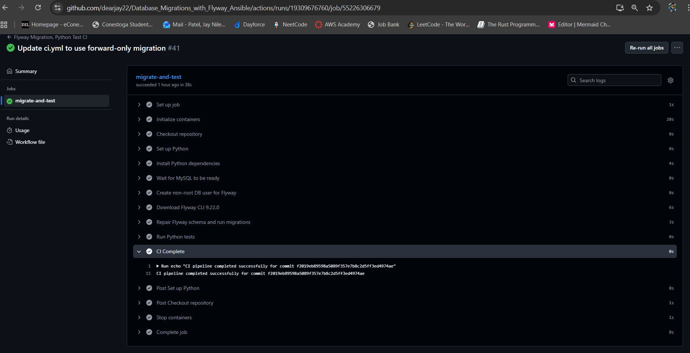
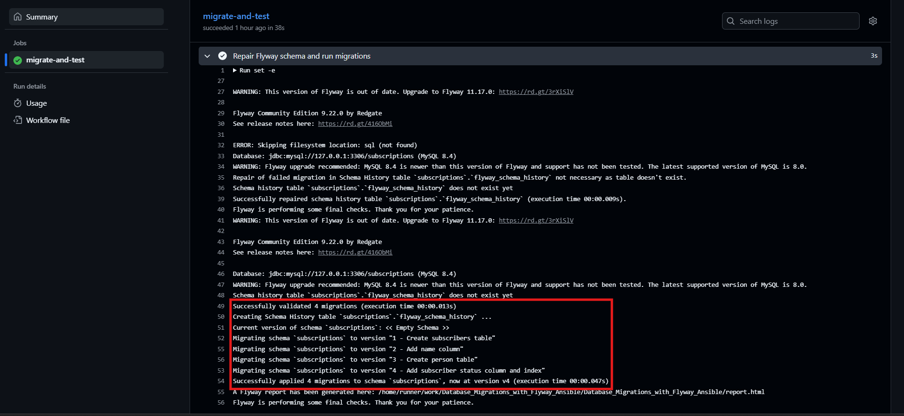
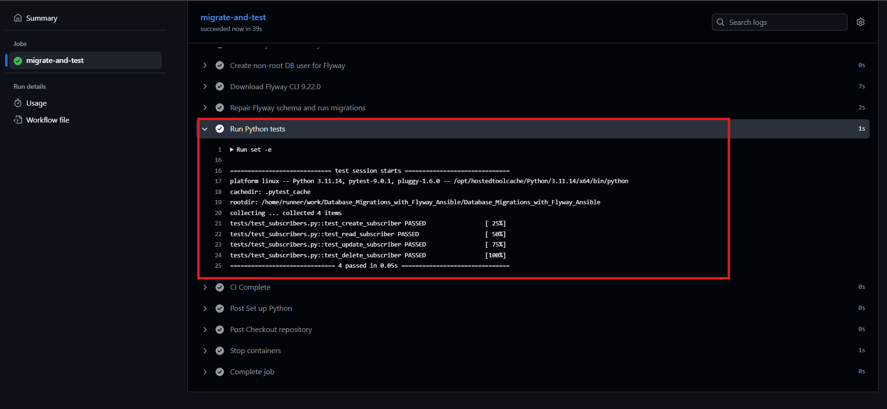

# PROG8850 Assignment 4: Database Automation with Flyway, Ansible, and CI/CD

This repository demonstrates automated database migration and testing using Flyway, Ansible, MySQL, and GitHub Actions. It fulfills the requirements for Assignment 4 of PROG8850.

## Assignment Requirements

**Question 1:** Analysis and comparison of two database migration tools [Q1_Tools_Analysis.md](Q1_Tools_Analysis.md) or [Q1_Tools_Analysis.pdf](Q1_Tools_Analysis.pdf).

**Question 2:**

- Use Ansible playbooks (`up.yml`, `down.yml`) to scaffold and remove a MySQL environment.
- Use Flyway for initial and incremental migrations (two folders: `migrations/` and `migrations_incremental/`).
- Automate migrations and tests with GitHub Actions.
- Print deployment status to the console.
- Provide clear instructions and repository link in README.

---

## CI/CD Pipeline Overview

The GitHub Actions workflow (`ci.yml`) performs the following steps:


1. Spins up a MySQL service
2. Waits for MySQL readiness
3. Creates the `subscribers` database and a non-root user (`sub_user`)
4. Applies Flyway migrations from both `migrations/` and `migrations_incremental/`
5. Sets up Python and installs test dependencies
6. Runs unit tests for CRUD operations
7. Prints deployment completion message to the console


---

## Local Setup Instructions


1. **Set up environment with Ansible:**

```sh
sudo ansible-playbook ansible/up.yml
```



2. **Run Python unit tests:**

```sh
pip install -r requirements.txt
pytest -v tests/test_subscribers.py
```



3. **Tear down environment:**

```sh
sudo ansible-playbook ansible/down.yml
```


---

## Troubleshooting

**Issue 1:** "Unknown Database 'subscribers'"
  - *Cause:* Flyway was trying to migrate before the database was created.
  - *Fix:* Added a step in the workflow to create the database before running Flyway.

**Issue 2:** "Access denied for user 'sub_user'@'172.18.0.1'"
  - *Cause:* The user lacked permissions or was not created in the CI environment.
  - *Fix:* SQL commands in the workflow create the user and grant privileges:
	 ```sql
	 CREATE USER IF NOT EXISTS 'sub_user'@'%' IDENTIFIED BY 'subpass';
	 GRANT ALL PRIVILEGES ON subscribers.* TO 'sub_user'@'%';
	 FLUSH PRIVILEGES;
	 ```

---

## Screenshots

CI/CD Run:


Flyway Migration:


Python Unit Tests:


---
